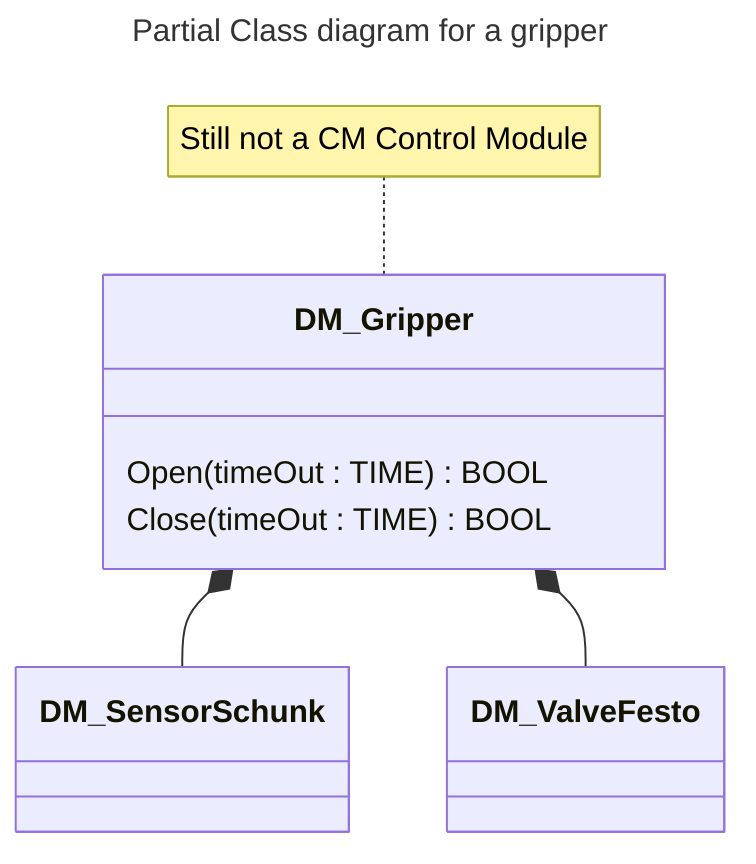
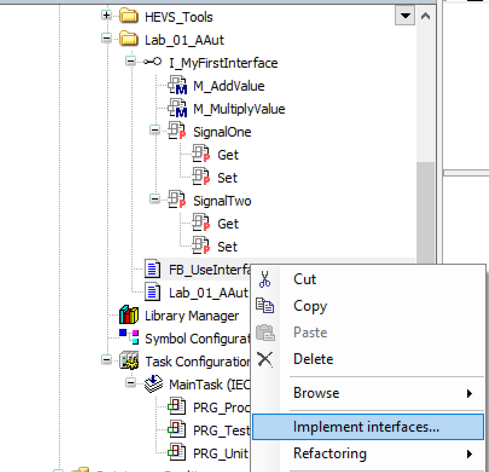
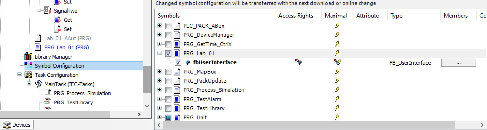
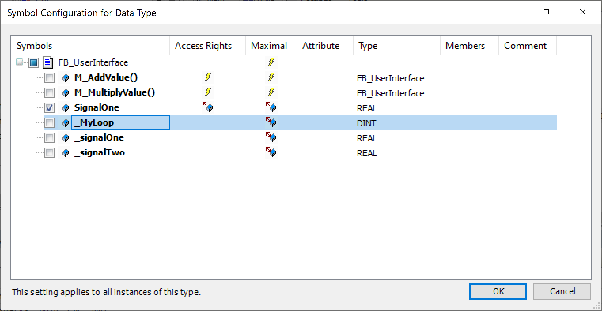
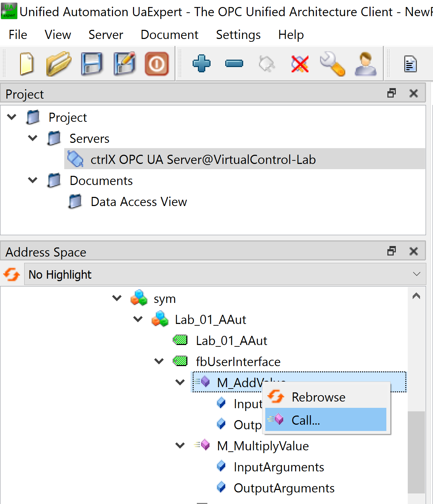
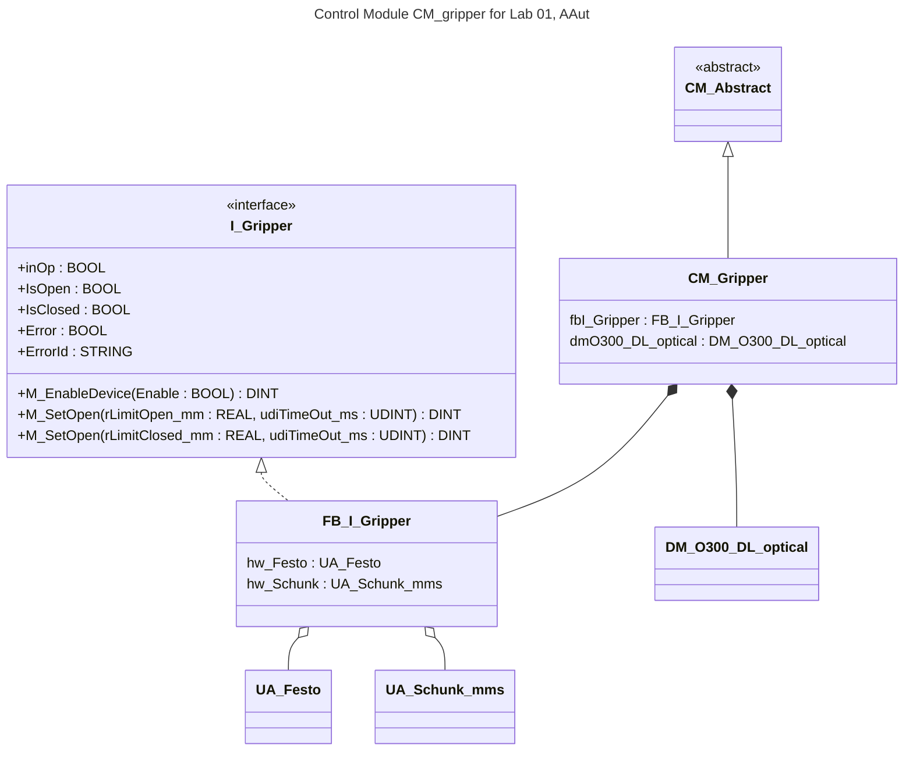

<h1 align="left">
  <br>
  
  <br> Advanced Automation Lab 01
  <br>
</h1>

Author: [Cédric Lenoir](mailto:cedric.lenoir@hevs.ch)

# Object Interface and Methods.
The goal of this lab is to understand the bases of IEC-61131-3 intefaces with methods and properties.

> If you have forgotten how to get the program and load it on the PLC, please have a look on this document: [Quick Start CtrlX PLC](https://github.com/hei-synd-autb/autb-lab-01_2026/blob/main/QuickStart_ctrlX_PLC.md).

> In general, it is possible to refer to the introductory lab of Base Automation, in [French](https://github.com/hei-synd-autb/autb-lab-01_2026/blob/main/README_FR.md), or in [German](https://github.com/hei-synd-autb/autb-lab-01_2026/blob/main/README_DE.md).

## Keywords
Method, Interface, Property, Absract.

# To prepare before the lab!
1.  The UML Schema in a Markdown file wiht mermaid.
2.  The internal code of the generator. But you will build the interface with methods and properies during the lab on the IDE.

**<span style="color: red;">It is unlikely that you will be able to complete this assignment if you do not prepare the code in advance.</span>**

## Note
I often use the term "device" or "DM" (Device Module) when an element is simply a component of a Control Module.

> In the example below, the gripper is not yet a Control Module because it does not include a PackML-type state machine.

<div align="center">


</div>

---

## Part One
### Testing the concept of interfaces and methods.
- We create a signal generator that uses an **interface** with the following properties:
- Set SampleSignal, which is: **a loop counter in the program**.
- Set Amplitude
- Set Frequency
- Get Signal
- A method to select the signal type. ``mSetForm(uiInterface.xFalseSinTrueSquare)``, [See below in Interface for UI](#interface-for-ui). *Using an ENUM is an elegant and easily extensible solution*.
- Accessible only internally, there are two methods:
- The first generates a sine wave.
- The second generates a square wave.

#### Help
- The main program provides a constant **PI**.

- The main program provides a structure that allows access to the Node-RED UI. ``ST_Lab_01_Interface``. This means we will use the generator's Set and Get methods to read from or write to this structure, simplifying the process.

- The main program **Lab_01_AAut** has a cycle time of 10ms.

- SampleSignal is ``SampleSignal := SampleSignal + 1``:

##### Use of SIN
En IEC 61131-3, ``SIN(rad)`` reçois un valeur en radian. 0 à $2 * PI$

##### Using MOD
- 10 MOD 3  :arrow_right: 1
- 15 MOD 5 :arrow_right: 0

##### Interface for UI

```iecst
TYPE ST_Lab_01_Interface :
STRUCT
  lrMySignal          : LREAL;
  lrAmplitude         : LREAL;
  lrFrequency         : LREAL;
  // Set to False for Sinus and TRUE for Square
  xFalseSinTrueSquare : BOOL;	
END_STRUCT
END_TYPE
```

```iecst
// In The Header of the Lab program
// Mapped to a UI Dashboard to display your signal from Get Signal
// And set your Generator using Set and Method.
  uiInterface : ST_Lab_01_Interface;
```

---

# Second part
Inheritance Concepts

In the lab, we have several Baumer sensors.

We assume we need to write a Function Block for each of these sensors.

1. O300 DL optical
2. O300 ZL optical
3. U300 D50 sound

The only common feature of all three sensors is the **Q** signal, ``GetQualityBit``, and the **A** signal, ``GetAlarmBit``. We will add a method `mSensorEnable(enable: BOOL): BOOL` to disable the sensor if it is not in use, because if an alarm has been added for the sensor, we want to be able to disable it.

We also want a property that returns the ``GetName`` of each device as a STRING.

- We want to be able to group all the devices in an array.
- We want a base sensor which implements base properties and methods of the interface., 
- Sensor DM_O300_DL_optical has a Get Property GetDistance : LREAL; *To measure the distance from the target on the camera.*
- Sensor DM_O300_ZL_optical has a Get Property GetDetected : BOOL;
- Sensor DM_U300_D50_sound has a Get Property GetHeight : LREAL; *This is the sensor near the gripper that measure the distance between the gripper and the plate*.

The sensor-to-hardware connection structure is given [in the appendix below](#structure-of-sensors).

## What you have to do.

1. Provide the complete UML diagram.
2. Create a prototype of each interface and object.
3. Only the O300 DL optical device needs to be implemented and display the camera's target distance. *With a Stop alarm if A and a Warning alarm if Q, see also the Siemens display. Note that if Q is true, then no distance is returned.*

You can find the access to the hardware via : ``GVL_Abox.uaAboxInterface``.

<div style="text-align: center;">
<figure>
  
  <figcaption>Implement interface of a Function Block</figcaption>
</figure>
</div>

## Method
You can remove the pragma once the method has been implemented.
```iecst
{warning 'Add method implementation '}
METHOD M_AddValue : REAL
```

> You could use this pragman in your program to not forget to complete something.

```iecst
{warning 'N oublie pas d ecrire myLoop++'}
_MyLoop := _MyLoop + 1;
```

<div style="text-align: center;">
<figure>
  
  <figcaption>You must select the variables you want to see externally, eg: via OPC-UA</figcaption>
</figure>
</div>

<div style="text-align: center;">
<figure>
  
  <figcaption>You must select the access rights of your variables and methods in ...</figcaption>
</figure>
</div>

## Attribute: monitoring
One drawback of properties is that they could be difficult to debug if you are in a real machine because the internal variables of the methods are not static, that is, unlike the variables of the Function Block they exisit onyl a fraction on second when the method is called. **Remember you must never use a break point in a real machine**.

One possibility is to use the pragma 

```iecst
{attribute 'monitoring' := 'variable'}
```

or

```iecst
{attribute 'monitoring' := 'call'}
```

> You **must** use such pragma to see the properties in the symbol list and access them from external.

> The pragma in the implementation **must** match the interface, else the compiler will display a warning.


```iecst
{attribute 'monitoring':= 'call'}
PROPERTY SignalTwo : REAL
```

The difference in very few words.

- `variable` is read only from external.
- `call` is read-write but has side effect if some code in the method.

For this lab, use <strong style="color: #FF0000;">call </strong> because of the subscribe mechanism.

For more details, have a look in the [Codesys documentation](https://content.helpme-codesys.com/en/CODESYS%20Development%20System/_cds_pragma_attribute_monitoring.html) or the blog of [Gerhard Barteling](https://www.plccoder.com/monitoring-attributes/).


### OPC-UA Expert
You can use the [UaExpert](https://www.unified-automation.com/downloads/opc-ua-clients.html) software, published by a leading OPC-UA solution provider, to view and test methods.

**UA Expert can be considered the reference client software for OPC-UA. If your server works correctly with UA Expert and there is a communication problem, then the issue lies with the client side.**

<div style="text-align: center;">
<figure>
  
  <figcaption>Use UaExpert to test properties & methods</figcaption>
</figure>
</div>

### Procedure for UaExpert
- Launch UaExpert
- Add Server
- Select custom server and opc.tcp://192.168.xxx.xxx
- Select Basic256Sha256 - Sign & Encript
- Fill in ``Username`` & ``Password``
- You must Trust the certificate in CtrlX > Settings > Certificates & Keys > OPC UA Server to validate connection.
- You have access to the PLC seleted data in the Root > Objects > Datalayer > plc > app > sym Lab_01_AAut.

The services offered for methods and properties by OPC-UA are similar to what can be used with the Node-RED palette to CtrlX Datalayer. The only difference is the configuration within CtrlX PLC Engineering.

---

# Part Three
Here, we'll use an existing Function Block, FB_I_Gripper, which we'll insert into a Control Module. For this, we'll start with the Control Module Abstract.

The basic structure of CM_Gripper is provided. I would have gladly left the work to the lab, but it would have been necessary to review the map in Node-RED. What interests us here is understanding how we can very simply use PackML's state methods to define the Gripper's behavior.

What we'll do:

1.  During **Clearing**, we activate the Gripper.
2.  During **Resetting**, we open the Gripper.
3.  During **Stopping**, we open the Gripper.
4.  During **Aborting**, we deactivate the Gripper.
5.  During Execute, we open the Gripper for 3 seconds when the laser sensor detects the target, then we close it when the detector loses the gripper.
6.  The FB_I_Gripper is designed so that it deactivates itself in case of an error. Therefore, an **Abort** level alarm must be used in case of an error on the Gripper. *Abort command cause a passage thru the Aborting state*

> If the DM_O300_DL_optical device, you will use it to program the CM_Gripper. Else you could use quick and dirty programming by using directly the [UA_O300_DL STRUCT, see below](#o300-dl).

<div align="center" width="300">



</div>

Parfois il peut être utile de ne pas compléter toutes les informations selon le niveau de détail que l'on veut présenter.


## Les signaux suivants sont disponibles.
```iecst
// Work on Control Modules here
fbI_Gripper(hw_Festo := GVL_Abox.uaAboxInterface.uaSchunkGripper,
            hw_Schunk := GVL_Abox.uaAboxInterface.uaSchunk);
```

### Parameters estimation
The gripper should open when valve is activated, else, close.

- rLimitOpen_mm := if < than 1 [mm];
- rLimitClosed_mm := if > than 8 [mm];
- udiTimeOut_ms := about 300 [ms];


# Add an alarm
Without diving in details in the alarm system, you can add an alarm in your function block using this code.

## Declaration of an alarm, or Warning

```iecst
  // Try an alarm
  fbSetAlarmSensor  : FB_HEVS_SetAlarm(diAlarmId := 101);	
```

## Calling the alarm
The details of alarms will be explained in module 06.

```iecst
// Set an alarm Stop in case of Gripper Error
fbSetAlarmSensor(xSetAlarm := xAlarmBitActive,
                 xAckAlarmTrig := TRUE,
                 Value := 1,
                 Message := CONCAT('Sensor Alarm bit : ', SensorName),
                 Category := E_EventCategory.Stop,
                 // Reference to plc time from PackTag
                 plcDateTimePack	:= PackTag.Admin.PLCDateTime,
                 // Link to PackTag Admin
                 stAdminAlarm := PackTag.Admin.Alarm,
                 stAdminAlarmHistory := PackTag.Admin.AlarmHistory);
```

> CONCAT is a concatenation of 2 strings.

### Structure of sensors

#### O300 DL
```iecst
TYPE UA_O300_DL :
STRUCT
  Value  : WORD;
  BCD1   : BOOL;
  // Quality flag
  Q      : BOOL;
  // Alarm flag
  A      : BOOL;
END_STRUCT
END_TYPE
```

#### O300 ZL
```iecst
TYPE UA_O300_ZL :
STRUCT
  BCD1   : BOOL;
  // Quality flag
  Q      : BOOL;
  // Alarm flag
  A      : BOOL;
END_STRUCT
END_TYPE
```

#### U300 D50
```iecst
TYPE UA_U300_D50 :
STRUCT
  Value : DWORD;
  Scale : SINT;
  SSC1  : BOOL;
  SSC2  : BOOL;
  Q     : BOOL;
  A     : BOOL;
  SSC4  : BOOL;
END_STRUCT
END_TYPE
```

### UA_Schunk_mms
```iecst
// Signal WORD pour 1000 incréments sur 10[mm]
TYPE UA_Schunk_mms :
STRUCT
	Value: WORD;
END_STRUCT
END_TYPE
```

### UA_Festo
```iecst
TYPE UA_Festo :
STRUCT
	SetOut: BOOL;
END_STRUCT
END_TYPE
```

### Structures for parameters

##### Parameters
We use LREAL Parameters, set in ``CtrlX PLC Application-HEVS_Tool-PRG_PackUpdate``.
Advantage, all parameters set in the same file.


<!-- End of this README file -->